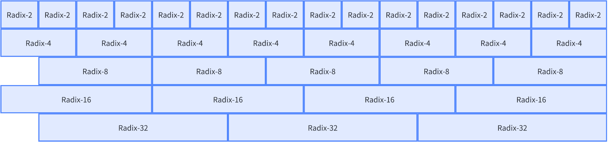

### Radix 组合间的映射函数

在上面的推导中，映射函数只考虑了使用一个 Radix 的情况，现在考虑多个 Radix 时数据的映射

我们最希望看到的情况当然是不同的Radix间在等价步骤的数据的等价的，这样我们不需要做任何额外的处理，让我们来推导验证一下

对于 $R_1$ $R_2$ 两个Radix 的总步骤数为 $L_1 = \log_{R_1}N$ $L_2 = \log_{R_2}N$，假设 $L_1 = 2L_2$ 即 $R_1 = R_2^2$，则

它们的等价步骤为 $l_1 = \{1,2,\cdots,L_1\}$ $l_2 = \{\{1,2\},\{3,4\},\cdots, \{L_2-1, L_2 \}\}$

我们只需要验证 $\text{Radix }R_1$ 中的第 $l_1$ 个步骤与 $\text{Radix }R_2$ 中的第 $\{2l_1-1,2l_1\}$ 步骤的映射等价

由于手推复合函数的工作量实在太大，这样验证实在有些困难

这里从另一个角度来解释这个问题

回顾一下 $\text{Radix }4$ 的递推公式

$$
\begin{align*}
X_N[k] 
&= X_{N/4}[4k] + \omega_N^kX_{N/4}[4k+1] + \omega_N^{2k}X_{N/4}[4k+2] + \omega_N^{3k}X_{N/4}[4k+3]\\
&= f^4_{N}(X_{N/4}[4k], X_{N/4}[4k+1], X_{N/4}[4k+2], X_{N/4}[4k+3])
\end{align*}
$$

在推导 $\text{Radix }2$ 过程中我们得到

$$
\begin{align*}
X_N[k]&= X_{N/2}[2k] + \omega_N^kX_{N/2}[2k+1]\\
&= f^2_{N}(X_{N/2}[2k], X_{N/2}[2k+1])\\
&= f^2_{N}(f^2_{N/2}(X_{N/4}[4k], X_{N/4}[4k+2]), f^2_{N/2}(X_{N/4}[4k+1], X_{N/4}[4k+3]))
\end{align*}
$$

两次$\text{Radix }2$ 的访问序列 $\{X_{N/4}[4k], X_{N/4}[4k+2], X_{N/4}[4k+1], X_{N/4}[4k+3]\}$ 
与 $\text{Radix }4$ 的访问序列 $\{X_{N/4}[4k], X_{N/4}[4k+1], X_{N/4}[4k+2], X_{N/4}[4k+3]\}$ 是等价的

同理可以推广到 $\log_2R$ 次 $\text{Radix }2$ 的访问序列与 $\text{Radix }R$ 的访问序列是等价的
$\text{Radix }R_1$ 与 $\log_2R_1$ 次$\text{Radix }2$ 的映射等价，$\text{Radix }R_2$ 与 $\log_2R_2$次$\text{Radix }2$ 的映射等价
所以 $\text{Radix }R_1$ 与 $log_{R_2}R_1$ 次 $\text{Radix }R_2$ 的映射等价

其实 Radix-4 Radix-8 …… 都可以看作是 Radix-2 的的递归展开，所以它们自上而下是等价的

为什么说是自上而下，这里涉及到一个对齐问题或等价替换问题

简单来说是 Radix-N 的替换必须与 Radix-N 计算步骤对齐，这样才能保证等价

这意味着在现有的公式下我们在前的贪心策略是不可行的，因为它会导致不对齐的情况

我们需要将未对齐的 Radix-N 细分为 Radix-N/2 直到对齐为止

或者我们可以推导Radix-N到第 $l$ 次 Radix-2的映射，来解决任意Radix间的映射问题，
更宽泛一点地说，我们可以推导 $\text{Radix } R_1$ 的第 $\overline{l_1}$ 次映射到 $\text{Radix } R_2$ 的映射

在前推导的映射函数如下

$$
X_{N/R^{\overline{l}}}[k] = _{R}f^{k-k \text{ mod } R^{\overline{l}}}_{N}
\begin{pmatrix}
X_{N/R^{\overline{l}+1}}[Rk+r\cdot R^{\overline{l}} - (R-1)\cdot(k \text{ mod } R^{\overline{l}})]
\end{pmatrix}
$$

为书写方便 记 $ d =\overline{l}$ 为 $\text{Radix } R$ 的递归深度 $ d \in \{0,1,2,\cdots,\log_RN-1\}$

$$
X_{N/R^{d}}[k] = _{R}f^{k-k \text{ mod } R^{d}}_{N}
\begin{pmatrix}
X_{N/R^{d+1}}[Rk+r\cdot R^{d} - (R-1)\cdot(k \text{ mod } R^{d})]
\end{pmatrix}
$$

$\text{Radix } R_1$ 的递归深度为 $d_1$

假定需要在 $\text{Radix } R_1$ $d_1$展开后 进行 $\text{Radix } R_2$ 的展开

$$
X_{N/R^{d_1}}[k] = _{R_1}f^{k-k \text{ mod } R_1^{d_1}}_{N}
\begin{pmatrix}
X_{N/R^{d_1+1}}[R_1k+r_1\cdot R_1^{d_1} - (R_1-1)\cdot(k \text{ mod } R_1^{d_1})]
\end{pmatrix}
$$

将 $R_1k$ 换元为 $R_1(R_2 k' + r_2)$

得到

$$
\begin{align*}
&X_{N/R^{d_1+1}}[R_1k'+r_1\cdot R_1^{d_1} - (R_1-1)\cdot(k' \text{ mod } R_1^{d_1})]\\
&= _{R_2}f^{k'}_{N/R^{d_1+1}} 
\begin{pmatrix}
X_{N/(R_1^{d_1+1}\cdot R_2)}
[R_1(R_2 k' + r_2)+r_1\cdot R_1^{d_1} - (R_1-1)\cdot(k' \text{ mod } R_1^{d_1})]\\
\end{pmatrix}
\end{align*}
$$

首先从 $R_1k'+r_1\cdot R_1^{d_1} - (R_1-1)\cdot(k' \text{ mod } R_1^{d_1}) = k$ 中求解 $k'$ 
但是这个函数按照函数的在数学上定义是没有反函数的，需要保留 $k'$

$$
k' = \frac{k - r_1\cdot R_1^{d_1} + (R_1-1)\cdot(k' \text{ mod } R_1^{d_1})}{R_1}
$$

我在推导时被卡在这里了，这种推导方法就留给读者钻研了

在这里通过另一个思路来推导

在 Radix-2 Radix-4 的推导中，因为带模的函数过于复杂，在推导过程中并没有使用带模的函数作为中继，而是从原始的递推式中不断进行递推，并在每一步中将其转换为带模的形式

令 $s \in \{0,1,2,\cdots,R_1^{d_1}\}$ 
$\text{Radix } R_1$ 的递归深度为 $d_1$ 的原始递推式为

$$
X_{N/R_1^{d_1}}[R_1^{d_1} k + s] = _{R_1}f^{k}_{N/R_1^{d_1}}\begin{pmatrix}
X_{N/R_1^{d_1+1}}[R^{d_1+1}k + R^{d_1}r_1 + s]
\end{pmatrix}
$$

在这一步后，进行 $\text{Radix } R_2$ 的展开，有$s \in \{0,1,2,\cdots,R^{d_1+1}\}$

$$
X_{N/R_1^{d_1+1}}[R_1^{d_1+1} k + s] = _{R_2}f^{k}_{N/R_1^{d_1+1}}\begin{pmatrix}
X_{N/(R_1^{d_1+1}\cdot R_2)}[R_1^{d_1+1}R_2k+R_1^{d_1+1}r_2 + s]
\end{pmatrix}
$$

这样求逆函数要容易地多，最终得到

$$
\begin{align*}
X_{N/R_1^{d_1+1}}[k] &= _{R_2}f^{(k-s)/R_1^{d_1+1}}_{N/R_1^{d_1+1}}
\begin{pmatrix}
X_{N/(R_1^{d_1+1}\cdot R_2)}[R_1^{d_1+1}r_2+R_2(k-s)+s]
\end{pmatrix}\\
&= _{R_2}f^{k-s}_{N}
\begin{pmatrix}
X_{N/(R_1^{d_1+1}\cdot R_2)}[R_1^{d_1+1}r_2+R_2k-(R_2-1)s]
\end{pmatrix}\\
&= _{R_2}f^{k-k\text{ mod }R^{d_1+1}}_{N}
\begin{pmatrix}
X_{N/(R_1^{d_1+1}\cdot R_2)}[R_2k+R_1^{d_1+1}r_2-(R_2-1) (k\text{ mod }R^{d_1+1})]
\end{pmatrix}\\
X_{N/R_1^{d_1}}[k] &= _{R_2}f^{k-k\text{ mod }R^{d_1}}_{N}
\begin{pmatrix}
X_{N/(R_1^{d_1}\cdot R_2)}[R_2k+R_1^{d_1}r_2-(R_2-1) (k\text{ mod }R^{d_1})]
\end{pmatrix}\\
\end{align*}
$$
化简
$$
\begin{align*}
R_2k+R_1^{d_1}r_2-(R_2-1) (k\text{ mod }R^{d_1}) 
&= R_2k+R_1^{d_1}r_2-(R_2-1) (k - R_1^{d_1} \lfloor \frac{k}{R_1^{d_1}} \rfloor)\\
&= R_2k+R_1^{d_1}r_2-R_2k+k + (R_2-1)R_1^{d_1} \lfloor \frac{k}{R_1^{d_1}} \rfloor\\
&= R_1^{d_1}r_2+k + (R_2-1)R_1^{d_1} \lfloor \frac{k}{R_1^{d_1}} \rfloor\\
k-k\text{ mod }R^{d_1}& = R_1^{d_1} \lfloor \frac{k}{R_1^{d_1}} \rfloor
\end{align*}
$$

$$
X_{N/R_1^{d_1}}[k] = _{R_2}f^{R_1^{d_1} \lfloor \frac{k}{R_1^{d_1}} \rfloor}_{N}
\begin{pmatrix}
X_{N/(R_1^{d_1}\cdot R_2)}[(R_2-1)R_1^{d_1} \lfloor \frac{k}{R_1^{d_1}} \rfloor +k+ R_1^{d_1}r_2]
\end{pmatrix}
$$

### 非二的整数幂的 Radix-N FFT

在上的公式可以直接推广到非二的整数幂的 Radix 因为在推导过程中并没有使用与整数幂相关的性质

在前推导的公式是多次使用一个 Radix 对一个 FFT 进行分解，然后使用第二个 Radix 进行一次分解

现在我们考虑自上向下使用 Raidx 序列 $\{R_0,R_1,R_2\cdots\}$ 对 FFT 进行分解

则有

$$
\begin{align*}
X_{N}[k] &= _{R_0}f^{k}_{N}
\end{align*}
$$